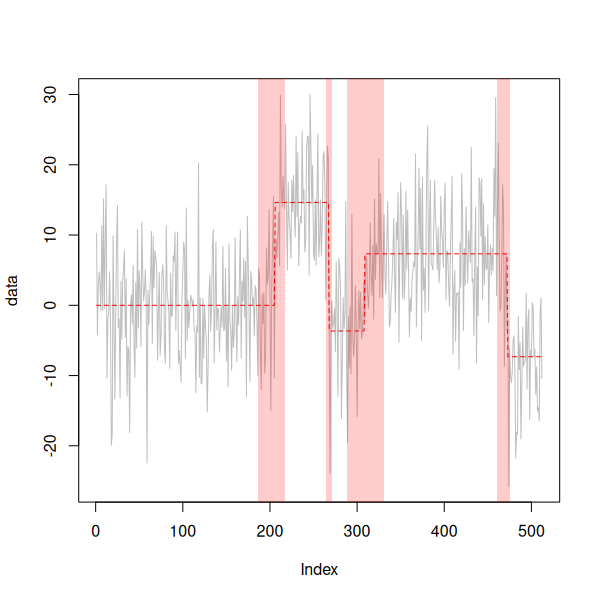
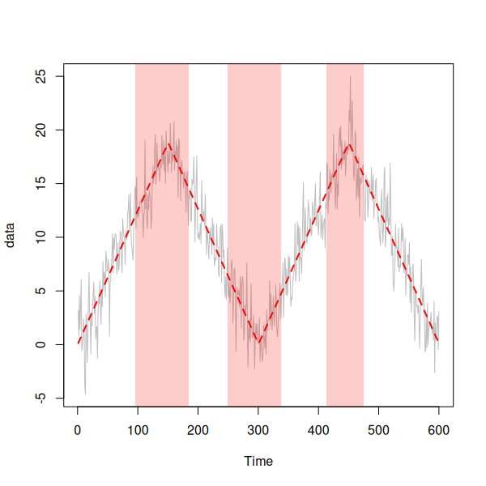

# Change Point Inference

R implementation of the procedure introduced in the paper "Fast and Optimal Inference for Change Points in Piecewise Polynomials via Differencing".

Given a vector of observations from a one dimensional signal + noise model, where the signal is a piecewise polynomial function of known degree, the procedure returns disjoint intervals which must each contain a change point location uniformly at some level specified by the parameter `alpha`. 

By default the contaminating noise is assumed to be independently distributed and Gaussian. However, this behaviour can be changed by setting the parameters `gaussian_noise` and `independent_noise` appropriately. 

## Installation

The R package can be installed this from this repository using `devtools`. 

```r
devtools::install_github("gaviosha/ChangePointInference")
```

## Usage 

### Piecewise constant signals + Gaussian noise

```r
library(ChangePointInference)

set.seed(42)

blocks <- c(rep(0,205),rep(14.64,62),rep(-3.66,41),rep(7.32,164),rep(-7.32,40))

yy <- blocks + rnorm(length(blocks), sd = 7.5)

diffInf_obj <- diffInf(yy, degree = 0, alpha = 0.1)


diffInf_obj |> plot(type = "l", col = "grey")

blocks |> lines(lty = 2, col = "red")

```




### Piecewise linear signal + coloured noise

```r
library(ChangePointInference)

set.seed(42)

waves_signal <- c((1:150) * (2**-3), (150:1) * (2**-3), (1:150) * (2**-3), (150:1) * (2**-3))

yy <- waves_signal + 2 * arima.sim(model = list(ar = 0.25), n = length(waves_signal))

diffInf_obj <- diffInf(yy, degree = 1, alpha = 0.1, independent_noise = FALSE)


diffInf_obj |> plot(type = "l", col = "grey")

waves_signal |> lines(lty = 2, lwd = 2, col = "red")
```



## References
