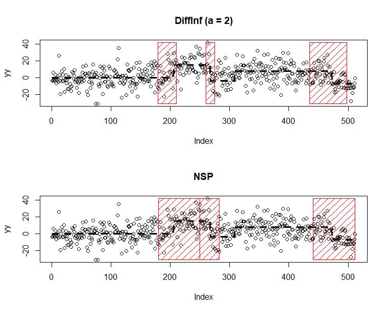

# diffInf
R implementation of the algorithm introduced in "Fast and Optimal Inference for Change Points in Piecewise Polynomials via Differencing"


## Usage 

A small example with the `blocks` signal. 

```r

library("nsp")

library("diffInf")

## blocks signal contaminated with Gaussian noise

set.seed(42)

par(mfrow = c(2,1))

blocks <- c(rep(0,205),rep(14.64,62),rep(-3.66,41),rep(7.32,164),rep(-7.32,40))

yy <- blocks + rnorm(length(blocks), sd = 10)


## DiffInf intervals

diffinf_obj <- diffInf(yy, degree = 0, alpha = 0.05)

yy |> plot(main = "DiffInf (a = 2)")

blocks |> lines(lty = 2, lwd = 3)

draw_rects(diffinf_obj, yrange = c(min(yy),max(yy)), col = "blue")


## NSP interval

nsp_obj <- nsp_poly(yy, deg = 0, alpha = 0.05)

yy |> plot(main = "NSP")

blocks |> lines(lty = 2, lwd = 3)

draw_rects(nsp_obj, yrange = c(min(yy),max(yy)), col = "red")

```


